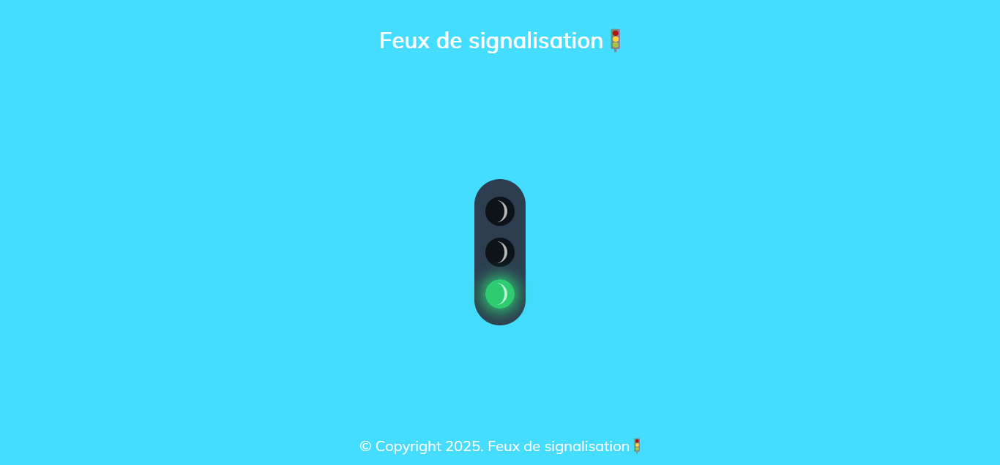

## PROJET : FEUX DE SIGNALISATION 🚦

## Le challenge

Création du projet : Feux de signalisation en HTML5, CSS3 et JavaScript.

## Démonstration

Lien vers le projet : https://aperbet56.github.io/feux_de_signalisation/

## Projet développé avec

- Utilissation des balises sémantiques HTML5
- CSS3
- Flexbox
- Pseudo-éléments
- Page web responsive
- Desktop first
- Utilisation d'un normaliseur : le fichier normalize.css
- Importation de la police "Muli"
- Commentaires HTML
- Commentaires CSS
- JavaScript
- Code JavaScript commenté
